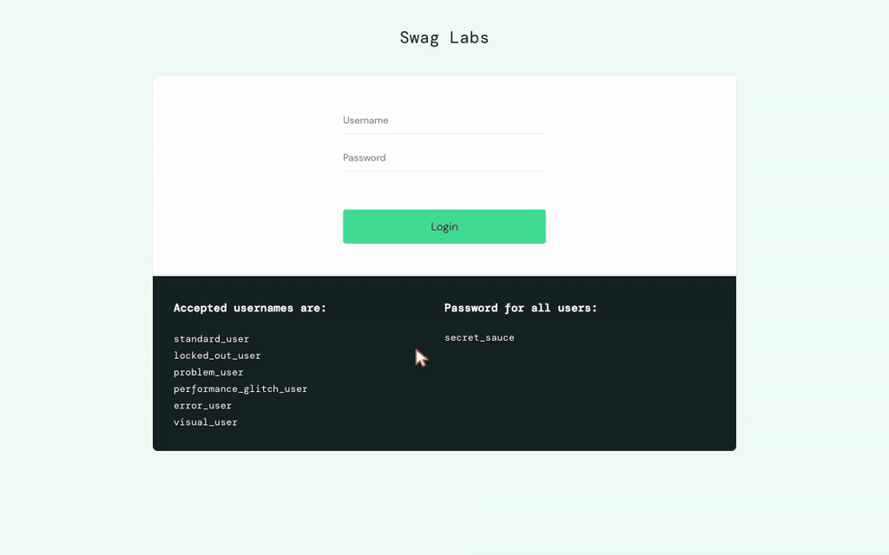

<p align="center">
  <picture>
    <source media="(prefers-color-scheme: dark)" srcset="./docs/images/logo/logo-lockup-dark.svg">
    
  </picture>
</p>

<p align="center">
  <strong>手順を伝えると、録画が返ってきます。</strong><br>
  <sub>コマンド 1 つで Web アプリを録画し、動画・スクリーンショット・runbook を返します。UAT、引き継ぎ、バグ報告、レビュー向け。</sub><br>
  <code>/webapp-evidence:recording</code>
</p>

<p align="center">
  <a href="./LICENSE"></a>
  <a href="#インストール"></a>
  <a href="#インストール"></a>
  <a href="#インストール"></a>
  <a href="#インストール"></a>
  <a href="#インストール"></a>
</p>

<p align="center">
  <a href="./README.md">English</a> · <a href="./README.vi-VN.md">Tiếng Việt</a> · <strong>日本語</strong> · <a href="./README.zh-Hans.md">简体中文</a>
</p>

アプリがちゃんと動くところを見せる場面は必ず来ます。UAT、別チームへの引き継ぎ、バグ
報告、デモ、レビュー。自分で録ると 30 分くらいかかっても、スクリーンショットは遅れ、マウスは
飛び、ドロップダウンは映像に出ないので何を選んだのか分かりません。

手順をコーディングエージェントに伝えてください。Chrome を操作して、動画、主要なステップの
スクリーンショット、同じ録画を再現できる runbook を返します。

## 例

```
/webapp-evidence:recording Page: https://www.saucedemo.com
Flow:
1. Log in using standard_user / secret_sauce
2. Change the sort dropdown to "Price (low to high)"
3. Add "Sauce Labs Backpack" to the cart, then open the cart
4. Checkout, fill First Name / Last Name / Zip as Minh / Tang / 700000
5. Continue, then Finish, and stop at the "Thank you for your order!" screen
```

## 出力

<p align="center">
  
</p>

主要なステップのスクリーンショットが 8 枚と、runbook が付きます。受け取った人は動画を見なくても
内容が分かります:

```markdown
## Steps in the video

00:00 - 00:01  Open the sign-in screen
00:01 - 00:08  Sign in as standard_user
00:08 - 00:13  Sort the product list by Price (low to high)
00:13 - 00:16  Add Sauce Labs Backpack to the cart
00:16 - 00:19  Open the shopping cart
00:19 - 00:26  Enter the customer information
00:26 - 00:29  Review the order summary
00:29 - 00:36  Finish the order

## Captions shown in the video

- 00:10  Selected "Price (low to high)". The dropdown menu is drawn by the operating
         system, so it does not appear in this recording.
- 00:31  The order is placed on the public saucedemo.com demo site, so no real data
         is created.

## Page errors recorded during the take

- [http 401] https://events.backtrace.io/api/unique-events/submit…
```

録画中はコンソールとネットワークも見ています。この例ではページが 401 を返していたことが分かり
ます。スクリーンショットには出ないし、普通は誰もそこを見ません。

実装中のセッションで録った場合は、スクリーンショットとエラーログを E2E と同じ目線で見ます。
401 や、はみ出したり崩れたレイアウト。気づいたものは指摘して、修正案も出せます。ファイルを渡す
だけではありません。

runbook には、その録画を作ったコマンドも残っています。データが変わった、動画が壊れた、もっと
ゆっくり見たい、というときはもう一度頼めばいいです。過去の録画は `v1`、`v2`、… として残り、
上書きされません。一度送った録画は、同じファイルとしては作り直せないからです。

## インストール

**Claude Code**

```bash
claude plugin marketplace add TOMOSIA-VIETNAM/webapp-evidence
claude plugin install webapp-evidence@webapp-evidence
```

**Cursor, Codex, Gemini CLI, Antigravity**

```bash
curl -fsSL https://raw.githubusercontent.com/TOMOSIA-VIETNAM/webapp-evidence/main/install.sh | bash
```

どのプラットフォームを使うか聞いたうえで、どこに入れたかを教えてくれます。録画には Chrome、
ffmpeg、Node が必要です。足りないものがあれば、エージェントが名前を挙げてインストールを提案
します。

ブランチを追う、またはバージョンを固定する場合:

```bash
curl -fsSL https://raw.githubusercontent.com/TOMOSIA-VIETNAM/webapp-evidence/main/install.sh | bash -s -- --ref main
```

`--ref v1.2.0` はバージョンの固定、`--ref latest` はリリース追従に戻ります。以降の実行は、最後に
指定されたものをそのまま追い続けます。更新は
`~/.webapp-evidence/scripts/install-local.sh --update`、削除は `--uninstall --all` です。

## 使い方

呼び出し方は使っているプラットフォームによって変わります:

| platform | command |
|---|---|
| Claude Code | `/webapp-evidence:recording` |
| Cursor, Gemini CLI, Antigravity | `/webapp-evidence-recording` |
| Codex | `$webapp-evidence-recording` |

頼めることは次のとおりです:

| やりたいこと | 入力するもの |
|---|---|
| いま直した画面の証跡 | `/webapp-evidence:recording` — 直前の作業から判断します |
| MR / PR の証跡 | `/webapp-evidence:recording https://gitlab.example.com/group/admin/-/merge_requests/1783` |
| 説明したとおりにページを録る | `/webapp-evidence:recording Page: https://app.example.com/search` に続けて手順を、上の例のように |
| 同じ内容をもう一度 | `/webapp-evidence:recording もう一度録って` — コマンドはランブックにあり、前の録画も残ります |
| もっとゆっくり録る | `/webapp-evidence:recording もう少しゆっくり録って` |
| 字幕を別の言語で | `/webapp-evidence:recording 字幕は英語で` — プロジェクトごとに覚えます |
| クリックがバックエンドまで届いた証拠 — ジョブが動いた、ファイルが書かれた | `/webapp-evidence:recording Run sync を押したあとワーカーのログを見せて` |
| 最初に一度だけ設定して、以降はログイン済みで録る | `/webapp-evidence:recording set up the evidence config for this project` |

手順は自分が使っている言語で書いてかまいません。エージェントも同じ言語で答えます。覚える構文も
ないので、「さっき直した画面の証跡を取って」で通じます。

## 録画ができたら

| やりたいこと | コマンド |
|---|---|
| README など画像しか表示できない場所に貼る gif がほしい | `/webapp-evidence:recording -f gif` |
| 自分で管理しているページに置く webm がほしい | `/webapp-evidence:recording -f webm` |
| 動画を見ずに、何が映っているか知りたい | `/webapp-evidence:vision <mp4 ファイル>` |
| 不具合を伝える、足りないものを頼む | `/webapp-evidence:feedback` |

既定が mp4 なのは、マージリクエストでも issue でもチャットでもそのまま再生でき、3 つの形式で
いちばん軽いからです。同じ録画の gif は数倍のサイズになるので、変換は提案するだけで勝手には
行いません。

`vision` があるのは、エージェントが動画を再生できないからです。数秒に 1 フレーム、`mm:ss` 付きの
シートに並べて画像として読みます。だから指摘は「00:14 でヘッダーが表とかぶっている」という形に
なります——自分で確認でき、runbook とも突き合わせられる時刻です。遷移の途中で崩れるレイアウト、
一瞬だけ出て消えるバナー。誰もスクリーンショットを撮ろうと思わなかったものを拾ってくれます。

上の録画から実際に作られたシートです:
**[シート 1](./docs/demo/vision-sheet-01.png)**（00:00–00:19）·
**[シート 2](./docs/demo/vision-sheet-02.png)**（00:20–00:36）。

## 制限

録画対象はページで、画面全体ではありません。OS が描画するものは映像に入りません:
`<select>` のドロップダウン、ファイル選択ダイアログ、`confirm`/`alert` ダイアログ。これらの
場面には、何を選んだかを示す字幕と、直後の状態のスクリーンショットが付きます。JS で作られた
モーダル、日付ピッカー、ドロップダウンは普通に録画されます。

証拠がページ上にまったく現れない場合 — ジョブが動いた、ファイルが書かれた — 手順の中で
ページの上にターミナルパネルを開き、実際のコマンドと実際の出力を同じ動画に収められます。
行単位の出力だけが対象で、`vim`、`less`、`htop` は使えません。

録画は指定したサイトだけを対象にします。

動画とスクリーンショットは Git に入りません。チケット、MR/PR、報告書のどこに添付するかは自分で
決めてください。

---

上の録画は、このリポジトリのランナーによる実際の出力です。`docs/demo/record.sh` が
`docs/demo/saucedemo-steps.js` から生成しています。スキル自体に手を入れたい場合は
**[CONTRIBUTING.md](./CONTRIBUTING.md)** を参照してください。
