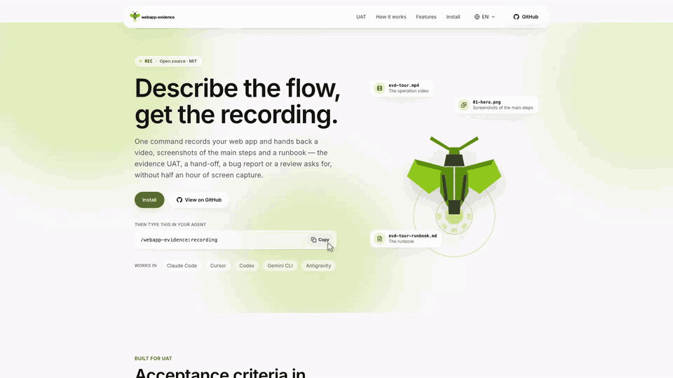
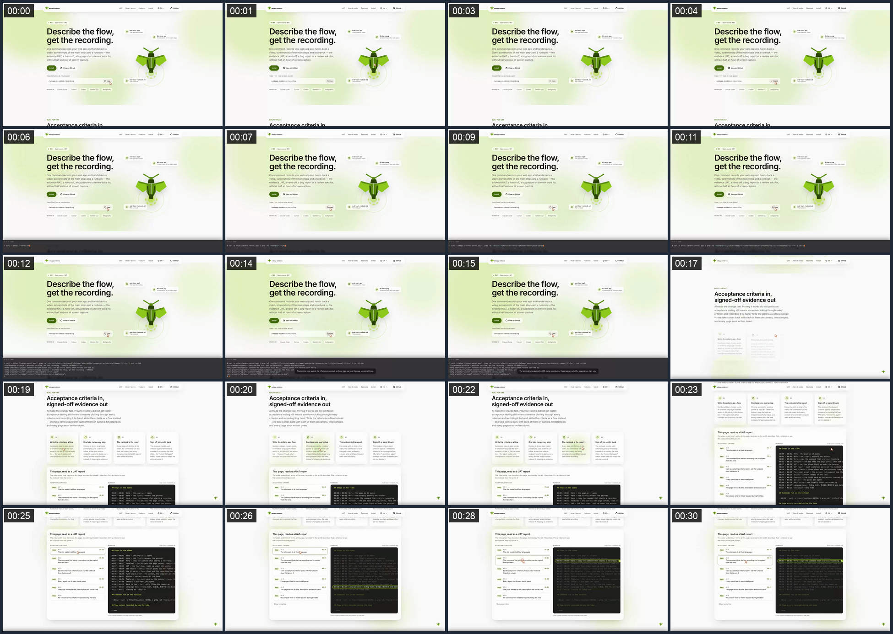
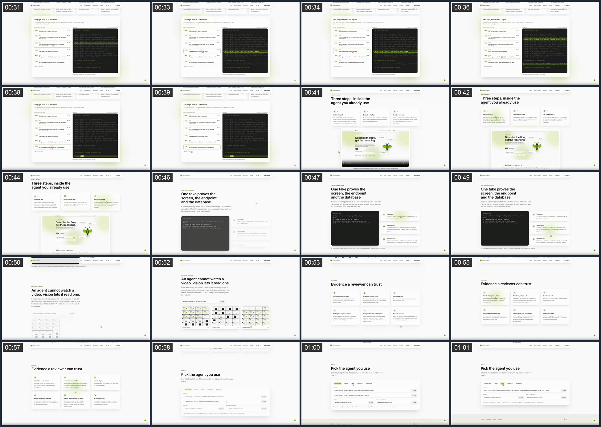
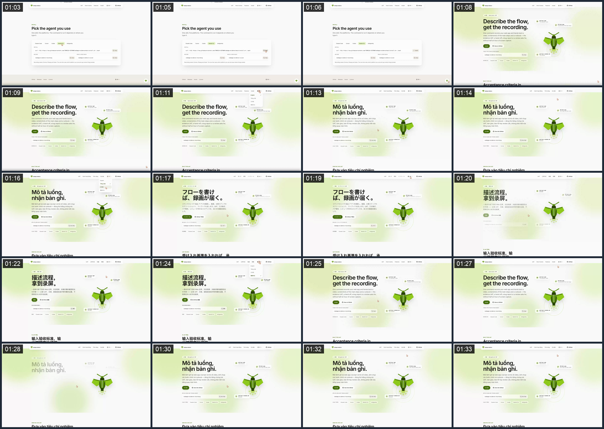

<p align="center">
  <picture>
    <source media="(prefers-color-scheme: dark)" srcset="./docs/images/logo/logo-lockup-dark.svg">
    
  </picture>
</p>

<p align="center">
  <strong>Describe the flow, get the recording.</strong><br>
  <sub>One command records your web app and returns a video, screenshots, and a runbook. For UAT, hand-offs, bug reports, and reviews.</sub><br>
  <code>/webapp-evidence:recording</code>
</p>

<p align="center">
  <a href="https://evdrec.vercel.app"></a>
  <a href="./LICENSE"></a>
  <a href="#install"></a>
  <a href="#install"></a>
  <a href="#install"></a>
  <a href="#install"></a>
  <a href="#install"></a>
</p>

<p align="center">
  <strong>English</strong> · <a href="./README.vi-VN.md">Tiếng Việt</a> · <a href="./README.ja-JP.md">日本語</a> · <a href="./README.zh-Hans.md">简体中文</a>
</p>

AI made the change fast. Proving it works did not get faster — UAT, a hand-off, a bug report and a
review all ask for the same thing, and recording it by hand still costs half an hour.

**`webapp-evidence` records that proof for you.** Describe the flow to the coding agent you already
use; it drives Chrome and hands back a video, screenshots of the main steps, and a runbook.

<p align="center">
  <a href="https://evdrec.vercel.app"></a><br>
  <sub>This project's own landing page, recorded by the skill it describes. One take, no editing.</sub>
</p>

- **One take, three kinds of proof** — the screen, the endpoint called with the browser's own
  session, and the database row it wrote. One video, one runbook.
- **It reads like a person did it** — the pointer travels, the typing is uneven, a scroll comes to
  rest on what it travelled to. Nothing jumps.
- **A runbook, not just a file** — the timeline, the captions, the commands run, the page errors
  seen, and the command that produces the same take again.
- **Secrets stay out** — blur, black out or cut a stretch, in the video and the screenshots alike.
- **Nothing leaves your machine** — no service, no bot account; it runs inside the agent CLI you
  already have, against the site you name and nothing else.

## Built for UAT

Acceptance testing still means someone clicking through every criterion and recording it by hand.
Write the criteria as a flow instead, and sign off against timestamps:

| 1 · Write the criteria | 2 · Record one take | 3 · Read the runbook | 4 · Sign off |
|---|---|---|---|
| Numbered steps in plain words, in any language — or an MR/PR link, and the agent derives the flow from the diff. | Chrome is driven by a visible pointer. A step that calls an endpoint asserts its status, so a wrong answer stops the take. | Every step with its time in the video, every command with its exit code, every console error and failed request. | The reviewer checks each criterion against a timestamp instead of re-running the flow. After a fix, `record that again`. |

The recording above is that loop run on this project's own site:
**[evdrec.vercel.app](https://evdrec.vercel.app)** reads its own take back as a UAT report.

## What one take proves

A screen recording shows half of a full-stack change. The same take can call the API with the
session the browser is already holding, and read the database back:

```
/webapp-evidence:recording Page: https://app.example.com/orders
Flow:
1. Create an order for SKU ABC, quantity 2
2. Call POST /api/orders and show it answering 201
3. Query the orders table and show the row that appeared
```

- **The screen.** The form is filled in and submitted by a visible pointer, at the pace a viewer
  reads at.
- **The endpoint.** A terminal panel opens over the page and curl runs there with the browser's
  cookies — `HTTP 201 in 0.184s`, on camera. The step asserts the status, so a wrong one fails the
  take instead of shipping as evidence.
- **The database.** `psql`, `mysql`, a rake task — whatever you would run yourself, in that same
  panel, with the new row in frame beside the screen that created it.

Cookies and tokens reach curl through a file and are masked everywhere: video, screenshots, runbook.

## What comes back

`<name>.mp4`, numbered screenshots, and `<name>-runbook.md` — so the person on the other end can
read the take instead of watching it. From the take above:

```markdown
## Steps in the video

00:05 - 00:17  Terminal — the SEO meta the page serves, read off its URL
00:24 - 00:41  UAT report — each criterion picks out the runbook lines that prove it
00:59 - 01:07  Install — one panel per agent

## Commands run in the terminal

- 00:12  `curl -s https://evdrec.vercel.app/ | grep -oE '<title>[^<]*</title>|…'` — exit 0

## Page errors recorded during the take

- none
```

It watches the console and the network while it records, so a 401 from a call nobody was looking at
lands in that last block with its status and URL. Recorded in the session where you built the
feature, the agent reads the screenshots and errors back the way an e2e pass would and proposes a
fix, rather than only handing over files.

Nothing is committed to Git. Attaching the files to a ticket, an MR or a report is yours to do.

## Install

**Claude Code**

```bash
claude plugin marketplace add TOMOSIA-VIETNAM/webapp-evidence
claude plugin install webapp-evidence@webapp-evidence
```

**Cursor, Codex, Gemini CLI, Antigravity**

```bash
curl -fsSL https://raw.githubusercontent.com/TOMOSIA-VIETNAM/webapp-evidence/main/install.sh | bash
```

It asks which platform you use and says where things landed. Recording needs Chrome, ffmpeg and
Node; the agent names anything missing and offers to install it.

To pin a release or follow a branch:

```bash
curl -fsSL https://raw.githubusercontent.com/TOMOSIA-VIETNAM/webapp-evidence/main/install.sh | bash -s -- --ref v1.1.3
```

`--ref main` follows the branch and `--ref latest` goes back to releases; every later run stays on
whichever was asked for last. Update with `~/.webapp-evidence/scripts/install-local.sh --update`,
remove it with `--uninstall --all`.

Where you type the command depends on the platform: `/webapp-evidence:recording` in Claude Code,
`/webapp-evidence-recording` in Cursor, Gemini CLI and Antigravity, `$webapp-evidence-recording` in
Codex.

## Ways to ask

There is no syntax to learn. *"Get evidence for the screen I just fixed"* works, in whatever
language you write it, and the agent answers in that language.

| You want | Type this |
|---|---|
| Evidence of the screen you just changed | `/webapp-evidence:recording` — it knows what you were working on |
| Evidence for an MR or PR | `/webapp-evidence:recording https://gitlab.example.com/group/admin/-/merge_requests/1783` |
| The same take again, after the data changed | `/webapp-evidence:recording record that again` — old takes are kept as `v1`, `v2`, … |
| A slower take, or captions in another language | `record it slower`, `captions in Japanese` — remembered per project |
| A secret kept out of the recording | `blur the API key when it appears` |
| The dropdown or dialog itself in the video | `--screen` — records the browser window, so what the OS draws is in frame |
| To stay off the screen, whatever the flow | `--headless` — the default, and the way to settle that question outright |
| A gif for a README, a webm for a page you control | `-f gif`, `-f webm` — mp4 otherwise, because it plays inline everywhere |
| To know what a video shows, without watching it | `/webapp-evidence:vision <the mp4>` — see below |
| Recordings that start signed in | `/webapp-evidence:recording set up the evidence config for this project` |
| To tell us something is wrong, or missing | `/webapp-evidence:feedback` |

## Read a take back

An agent cannot watch a video. `vision` tiles one into contact sheets — frames at a steady interval,
each stamped `mm:ss` — so a finding comes back as "the header overlaps the table at 00:14", a time
you can check against the runbook. The take above, as the agent reads it:

<p align="center">
  <a href="./docs/demo/vision-sheet-01.png"></a>
  <a href="./docs/demo/vision-sheet-02.png"></a>
  <a href="./docs/demo/vision-sheet-03.png"></a>
</p>

## Limits

It records the page, not your screen, so what the operating system draws stays out: `<select>`
dropdowns, the file picker, `confirm`/`alert` dialogs. Each gets a caption of what was chosen and a
screenshot of the state right after; modals, date pickers and JS dropdowns record normally. When one
of those dialogs *is* the evidence, `--screen` records the browser window instead — that needs a
screen, your permission and the machine left alone for the length of the take, so the agent asks
first.

The terminal panel takes line-oriented output: `vim`, `less` and `htop` are out.

---

The recording above is real output from this repo's runner: `docs/demo/record.sh` records the site
in `webapp/` from `docs/demo/tour-steps.js`, and the same take plays on
[evdrec.vercel.app](https://evdrec.vercel.app). To work on the skill itself, see
**[CONTRIBUTING.md](./CONTRIBUTING.md)**.
