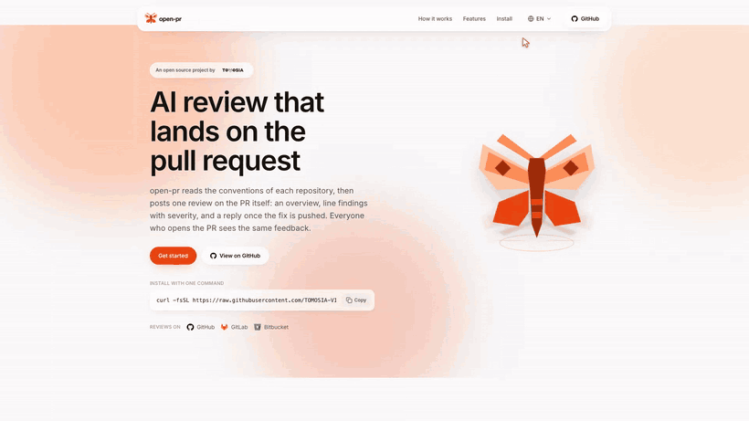

<p align="center">
  <picture>
    <source media="(prefers-color-scheme: dark)" srcset="./docs/images/logo/logo-lockup-dark.svg">
    
  </picture>
</p>

<p align="center">
  <strong>Describe the flow, get the recording.</strong><br>
  <sub>One command records your web app and returns a video, screenshots, and a runbook. For UAT, hand-offs, bug reports, and reviews.</sub><br>
  <code>/webapp-evidence:recording</code>
</p>

<p align="center">
  <a href="./LICENSE"></a>
  <a href="#install"></a>
  <a href="#install"></a>
  <a href="#install"></a>
  <a href="#install"></a>
  <a href="#install"></a>
</p>

<p align="center">
  <strong>English</strong> · <a href="./README.vi-VN.md">Tiếng Việt</a> · <a href="./README.ja-JP.md">日本語</a> · <a href="./README.zh-Hans.md">简体中文</a>
</p>

At some point you need to show that the app actually works: UAT, a hand-off to another team, a
bug report, a demo, a review. Recording it yourself takes about half an hour and the
video still looks bad — screenshots a beat late, the mouse jumping around, dropdowns that never
open on camera so nobody can tell what you picked.

Describe the flow to your coding agent instead. It drives Chrome and returns a video, screenshots
of the main steps, and a runbook so you can reproduce the same recording.

## Example

```
/webapp-evidence:recording Page: https://open-pr.vercel.app
Flow:
1. Open the language menu, go through every language, then come back to English
2. Hover the moth in the hero, then copy the one-line install command
3. Read down the page: How it works, the review-round walkthrough and every step of
   the loop, the feature cards, the token-cost chart
4. On Install, switch to the Codex and Cursor tabs, then copy the command of the open one
5. Take the floating button back to the top, print the SEO meta the page serves in a
   terminal, and close the tour in Japanese
```

## What you get

<p align="center">
  
</p>

The gif is one stretch of a longer take — a gif of the whole thing is several times the size, and
a README is not the place for that. Twenty-five screenshots of the main steps come with it, plus a
runbook so the person on the other end can read the take instead of watching it:

```markdown
## Steps in the video

00:00 - 00:01  Hero — the page as it opens
00:01 - 00:15  Language menu — every language the site ships
00:15 - 00:19  Back to English — the language the rest of the tour runs in
00:19 - 00:21  Hero — the moth answers the pointer
00:21 - 00:26  Hero — copy the one-line install command
00:26 - 00:32  How it works — the three steps light up under the pointer
00:32 - 00:36  Review rounds — the walkthrough plays itself
00:36 - 00:49  Review rounds — every step of the loop, picked by hand
00:49 - 00:54  Features — the cards warm as the pointer crosses them
00:54 - 00:56  Token cost — the chart the plugin publishes
00:56 - 01:03  Install — one panel per agent
01:03 - 01:05  Install — copy the command of the open panel
01:05 - 01:09  Footer — the links at the end of the page
01:09 - 01:13  The floating button flies the reader back to the top
01:13 - 01:26  The SEO meta the page serves, read straight off the URL
01:26 - 01:32  Closing on 日本語

## Captions shown in the video

- 00:23  The command is on the clipboard. The button was read back for its "Copied"
         state, because a blocked clipboard leaves a click that proves nothing.
- 01:13  The terminal panel runs against the live URL, so these tags come from what
         the site is serving right now.

## Commands run in the terminal

- 01:24  `curl -s https://open-pr.vercel.app/ | grep -oE '<title>[^<]*</title>|…'` — exit 0

## Page errors recorded during the take

- none
```

While it records, it also watches the console and the network. This take came back clean, which is
itself a claim the reader can check. When it doesn't, every error lands in that last block with its
status and URL — a 401 from a call nobody was watching is not something a screenshot would show.

If you recorded in the same session where you were building the feature, the agent looks at those
screenshots and errors the way an e2e pass would. A 401, a layout that overflows or slips — it can
point them out and propose a fix, instead of only handing you the files.

The runbook also stores the exact command that produced the recording. If the data changed, the
video broke, or someone wants it slower, ask again. Old recordings are kept as `v1`, `v2`, … and
never overwritten — once you've sent a recording out, you can't recreate that exact file.

## Install

**Claude Code**

```bash
claude plugin marketplace add TOMOSIA-VIETNAM/webapp-evidence
claude plugin install webapp-evidence@webapp-evidence
```

**Cursor, Codex, Gemini CLI, Antigravity**

```bash
curl -fsSL https://raw.githubusercontent.com/TOMOSIA-VIETNAM/webapp-evidence/main/install.sh | bash
```

It asks which platform you use and tells you where things landed. Recording needs Chrome, ffmpeg and
Node — if one is missing, the agent names it and offers to install it.

To follow a branch or pin a version:

```bash
curl -fsSL https://raw.githubusercontent.com/TOMOSIA-VIETNAM/webapp-evidence/main/install.sh | bash -s -- --ref main
```

`--ref v1.2.0` pins a version and `--ref latest` goes back to releases; every later run stays on
whichever was asked for last. Update with `~/.webapp-evidence/scripts/install-local.sh --update`,
remove it with `--uninstall --all`.

## Using it

How you call it depends on where you are:

| platform | command |
|---|---|
| Claude Code | `/webapp-evidence:recording` |
| Cursor, Gemini CLI, Antigravity | `/webapp-evidence-recording` |
| Codex | `$webapp-evidence-recording` |

What you can ask for:

| You want | Type this |
|---|---|
| Evidence of the screen you just changed | `/webapp-evidence:recording` — it knows what you were working on |
| Evidence for an MR or PR | `/webapp-evidence:recording https://gitlab.example.com/group/admin/-/merge_requests/1783` |
| A page recorded from your description | `/webapp-evidence:recording Page: https://app.example.com/search` then the steps, like the example above |
| The same recording again | `/webapp-evidence:recording record that again` — the runbook keeps the command, old takes are never overwritten |
| A slower recording | `/webapp-evidence:recording record it slower` |
| Captions in another language | `/webapp-evidence:recording captions in Japanese` — remembered per project |
| Proof the click reached the backend — a job ran, a file was written | `/webapp-evidence:recording show the worker log after clicking Run sync` |
| The dropdown or dialog itself in the video, not a caption of it | `/webapp-evidence:recording --screen` — hands your machine over for a minute; without the flag it asks first |
| A secret kept out of the recording | `/webapp-evidence:recording blur the API key when it appears` |
| A project set up once, so recordings start signed in | `/webapp-evidence:recording set up the evidence config for this project` |

Write the steps in whatever language you use, and the agent replies in that language. There's no
syntax to memorise either — "get evidence for the screen I just fixed" works fine.

## Once you have a recording

| You want | Command |
|---|---|
| A gif, for a README or anywhere that only renders images | `/webapp-evidence:recording -f gif` |
| A webm, for a page you control | `/webapp-evidence:recording -f webm` |
| To know what the video shows, without watching it | `/webapp-evidence:vision <the mp4>` |
| To tell us something is wrong, or missing | `/webapp-evidence:feedback` |

mp4 stays the default: it plays inline in a merge request, an issue and every chat tool, and it's the
smallest of the three. A gif of the same recording is several times larger, so you get an offer
rather than a surprise.

`vision` is there because an agent can't watch a video. It tiles one into sheets — a frame every
couple of seconds, each stamped `mm:ss` — and reads those as images. So a finding comes back as "the
header overlaps the table at 00:14", a time you can check yourself and match to the runbook. It picks
up what nobody thought to screenshot: a layout that breaks mid-transition, a banner that flashes and
is gone.

Here are the sheets it produced from the recording above:
**[sheet 1](./docs/demo/vision-sheet-01.png)** (00:00–00:38) ·
**[sheet 2](./docs/demo/vision-sheet-02.png)** (00:40–01:18) ·
**[sheet 3](./docs/demo/vision-sheet-03.png)** (01:20–01:32).

## Limits

It records the page, not your screen. OS-drawn UI stays out of the video: `<select>` dropdowns, the
file picker, `confirm`/`alert` dialogs. Those get a caption of what was chosen, plus a screenshot
of the state right after. Modals, date pickers, and JS dropdowns record normally.

When one of those dialogs is the thing you need to show, it can record the browser window instead,
and then they are in the video. That needs a screen, permission, and the machine left alone for the
length of the take, so it is not the default — your agent asks before it does that, and a notice
appears on screen telling you where the question is. Ask for it outright with
`/webapp-evidence:recording --screen`.

A secret that appears on screen can be blurred, blacked out, or cut from the take — say so when you
describe the flow, and it is kept out of the screenshots too.

When the proof is not on the page at all — a job that ran, a file that was written — a step can
open a terminal panel over the page and put the real command and its real output in the same
video. Line-oriented output only: `vim`, `less` and `htop` are out.

Recording runs against the site you name, and nothing else.

Videos and screenshots are not committed to Git. Attaching them to a ticket, MR/PR, or report is up
to you.

---

The recording above is real output from this repo's runner: `docs/demo/record.sh` produces it from
`docs/demo/site-tour-steps.js`. If you want to work on the skill itself, see
**[CONTRIBUTING.md](./CONTRIBUTING.md)**.
