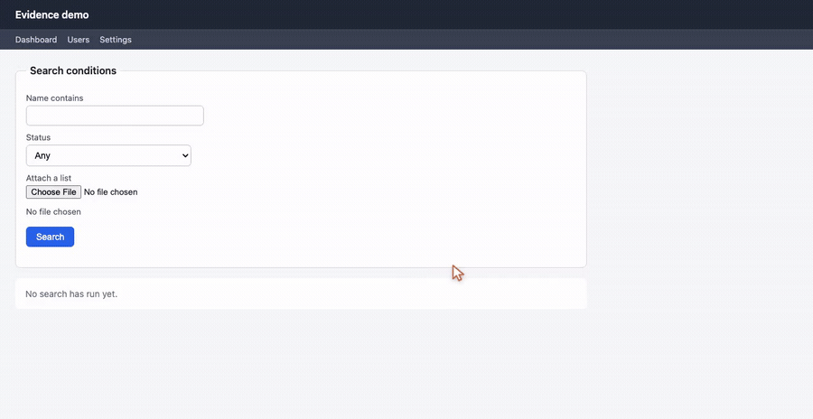

<p align="center">
  <picture>
    <source media="(prefers-color-scheme: dark)" srcset="./docs/images/logo/logo-lockup-dark.svg">
    
  </picture>
</p>

<p align="center">
  <strong>The proof records itself.</strong><br>
  <sub>An operation video, screenshots and a runbook — from one sentence in your agent.</sub><br>
  <code>/webapp-evidence:recording</code>
</p>

<p align="center">
  <a href="./LICENSE"></a>
  <a href="#install"></a>
  <a href="#install"></a>
  <a href="#install"></a>
  <a href="#install"></a>
  <a href="#install"></a>
</p>

<p align="center">
  
</p>

Reviewers ask for proof. Customers ask for proof. And the honest answer is usually a screenshot
taken at the wrong moment, or a screen recording where the mouse teleports, the dropdown never
appears, and nobody can tell which button was pressed.

That is not a recording problem. It is that **a real browser session, replayed for a human to watch,
is tedious to produce by hand** — so people stop producing it, and the review goes ahead on trust.

`webapp-evidence` makes it one sentence:

```
/webapp-evidence:recording
```

The agent works out which screen changed from the conversation you were already having, drives a
real Chrome through it, and hands you back an mp4, the screenshots, and a runbook that says what
happens at each timestamp and how to record it again.

## What makes the video watchable

A machine-driven recording is instantly recognisable: the cursor jumps in straight lines, every wait
is exactly the same length, and values appear in fields with nobody touching them. This one is built
for the person watching it:

- **The cursor is visible and moves like a hand** — a slightly curved path, quick to accelerate and
  slow to brake, overshooting a distant target before correcting. Every click leaves a ripple.
- **The pace follows what is on screen.** Clicks that only navigate go briskly; the moment a result
  appears, it is held long enough to read. Waits vary instead of ticking identically.
- **What the frame cannot hold is said out loud.** A `<select>` menu and a file picker are drawn by
  the operating system and never enter a page recording — so a caption says what was chosen, and why
  the widget is not visible. Keyboard shortcuts raise a key hint overlay (`⌘ + C`) beside the
  element they act on.
- **The page-load wait is trimmed** off the front, so the video starts where the work starts.

The explanation lives in the runbook, not burned into the video — fixing the wording never means
recording again.

## Install

Needs **Google Chrome**, **ffmpeg** and **Node.js**. On macOS: `brew install ffmpeg`.

**Claude Code**

```bash
claude plugin marketplace add TOMOSIA-VIETNAM/webapp-evidence
claude plugin install webapp-evidence@webapp-evidence
```

**Cursor, Codex, Gemini CLI, Antigravity**

```bash
curl -fsSL https://raw.githubusercontent.com/TOMOSIA-VIETNAM/webapp-evidence/main/install.sh | bash
```

It asks which platform you want and sets up the runner's dependency itself.

### Picking a version

The one-liner installs the newest release tag, or `main` while there are no releases yet. To follow
something else, pass `--ref`:

```bash
# a branch — to try a change before it ships
curl -fsSL https://raw.githubusercontent.com/TOMOSIA-VIETNAM/webapp-evidence/main/install.sh | bash -s -- --ref main

# a specific release — to pin a team to one version
curl -fsSL https://raw.githubusercontent.com/TOMOSIA-VIETNAM/webapp-evidence/main/install.sh | bash -s -- --ref v1.2.0

# back to following releases
curl -fsSL https://raw.githubusercontent.com/TOMOSIA-VIETNAM/webapp-evidence/main/install.sh | bash -s -- --ref latest
```

The clone remembers what you chose, so re-running the one-liner to update keeps you on that branch
or tag instead of dropping you back onto releases. `~/.webapp-evidence/scripts/install-local.sh
--update` does the same from the clone itself.

Install from a branch and that branch later gets merged and deleted, and the next plain run stops
with `has no ref named …` — the ref is gone, and nothing is guessed on your behalf. `--ref latest`
puts you back on releases.

One thing the one-liner cannot do is upgrade itself ahead of time: `install.sh` is always fetched
from the default branch, so a new flag only reaches you once it is merged there, even when you ask
for a branch that already has it.

Full guide, including where each platform puts it and how to remove it:
**[Install](./docs/install.md)**.

## Using it

| platform | how you call it |
|---|---|
| Claude Code | `/webapp-evidence:recording` |
| Cursor, Gemini CLI, Antigravity | `/webapp-evidence-recording` |
| Codex | `$webapp-evidence-recording` |

**You just finished a task or a bug fix.** The agent already knows which screen changed:

```
/webapp-evidence:recording
```

**A fresh session, and all you have is the link.** It reads the MR/PR — description and diff — and
works out what to record:

```
/webapp-evidence:recording https://gitlab.example.com/group/admin/-/merge_requests/1783
```

**You don't write code.** Give the page and say what to show, in your own words:

```
/webapp-evidence:recording record the search page at https://app.example.com/search:
type "abc", press Search, capture the results
```

No repository, no config, nothing to set up — the agent opens the page, follows the steps you
described, and hands back the video and the screenshots with the folder they are in. Write the steps
in whatever language you think in; the agent replies in the same one.

There is no syntax to remember either. "Get evidence for the screen I just fixed" does the same
thing.

## What you get

```
user-search.mp4                        the operation video
user-search-runbook.md                 timeline + shortcuts + captions + how to run it again
01-index.png … 99-full-page.png        screenshots, one per step
steps.js                               the recorded steps, editable and re-runnable
user-search-console.log                only present when the page had errors
```

Ask for a re-record any time — the data moved on, the video broke, the reviewer wants it slower. The
runbook holds the exact command, and previous takes are kept in `v1`, `v2`… rather than overwritten,
because evidence already sent with an MR is the one thing you cannot regenerate.

Videos and screenshots are **not committed** to Git. You attach them to the MR/PR yourself.

## First time in a project

The agent needs to know where the app runs, how to bring the environment up, and how to log in. Ask
once:

```
/webapp-evidence:recording set up the evidence config for this project
```

It probes the login screen, finds a dev account, and writes an `evidence.config.js` into the
project. After that, asking for evidence is all it takes.

## Tuning it

Say what you want — "record it slower", "captions in Japanese", "keep only the newest take". The
settings live in the project's `evidence.config.js`:

```js
recording: {
  speed: 'slow',                             // like video playback speed: 'fast' | 'normal' | 'slow' | 'slowest'
  captions: { enabled: true, locale: 'ja' }, // caption language: en | ja | vi
},
output: {
  overwrite: false,                          // false: previous takes are kept in evidence/v1, v2…
},
```

Frame size, video quality and the wait after each kind of action are adjustable too.

## Limitations

The video records the page, not your screen, so anything the operating system draws stays out of
frame: `<select>` dropdowns, the file picker, and the browser's `confirm`/`alert` dialogs. Those
moments carry a caption saying what was chosen, plus a screenshot of the state afterwards. Modals,
date pickers and dropdowns built in JS record normally.

Recording only ever runs against local dev — never staging, never production.

---

The demo above is recorded by this repository's own runner against the demo app in `tests/e2e/app`,
with `docs/demo/record.sh`. Working on the skill itself? See **[CONTRIBUTING.md](./CONTRIBUTING.md)**.
